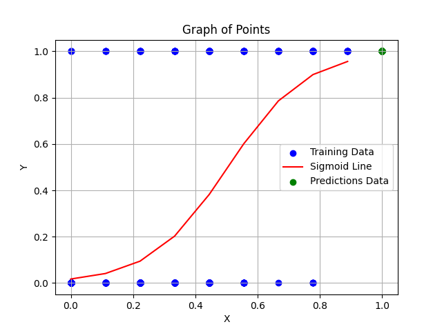

# Trabalho de cálculo
### Adriel Domingues de Souza Andrade, Gabriel da Pureza Irmão
### FATEC Rubens Lara
### 3º Ciclo de Ciência de Dados

## Regressão Linear:


### Objetivo:
O objetivo é encontrar a reta que melhor se ajusta aos dados fornecidos a partir do algoritmo de gradiente descendente.

### Modelo
Regressão linear de 2º grau e gradiente descendente

---

## Regressão Logística:


### Objetivo:
O objetivo é encontrar a linha sigmoidal que melhor se ajusta aos dados fornecidos a partir do algoritmo de gradiente descendente.

### Modelo:
Regressão logística e gradiente descendente

### Execução:
```bash
python3 logistic-regression.py <float learning_rate> <float tolerance>
```

## Rede Neural:


### Objetivo:
O objetivo da rede neural é classificar os dados do dataset de cancer de mama, para podermos comparar o resultado com a regressão logistica.

### Modelo
Rede neural e gradiente descendente

---

### Dataset:
[Dataset breast-cancer Kaggle](https://www.kaggle.com/datasets/marshuu/breast-cancer)